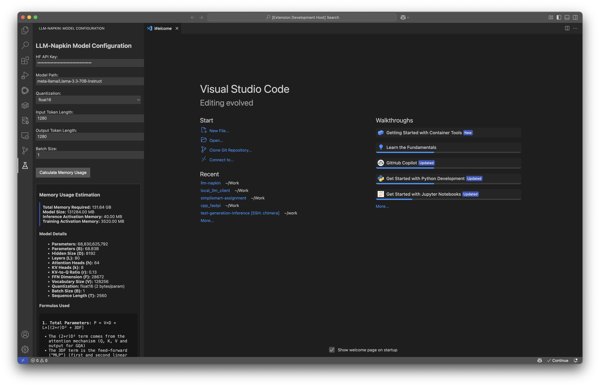

# LLM-Napkin

A VS Code extension for calculating memory requirements and parameter counts for Large Language Models.

## Features

LLM-Napkin helps you understand the memory footprint of transformer-based language models by providing accurate estimates based on model configuration files from Hugging Face.

Key capabilities:
- Load model configurations directly from Hugging Face repositories
- Calculate precise parameter counts with support for modern architectures (GQA, GLU)
- Estimate memory requirements for both inference and training
- Adjust calculations based on quantization level (FP16, INT8, INT4)
- Visualize how batch size and sequence length affect memory usage



## How to Use

1. Click the LLM-Napkin icon in the VS Code Activity Bar
2. Enter the Hugging Face model path (e.g., `Qwen/Qwen3-4B`)
3. Optionally enter your Hugging Face API key (required for private models)
4. Adjust settings for quantization, sequence length, and batch size
5. Click "Calculate Memory Usage" to see detailed results

## Memory Calculation Method

LLM-Napkin uses precise formulas derived from transformer architecture analysis:

### Parameter Count Formula
```
P = VD + L×[(2+r)D² + 3DF]
```
Where:
- V = Vocabulary size
- D = Hidden dimension
- L = Number of layers
- r = KV-to-Q head ratio (for GQA)
- F = Feed-forward dimension

### Memory Requirement Formulas
- Weights memory: `Mₚ = P × b` (bytes)
- Inference activation memory: `Mₐ = B × T × D × b` (bytes)
- Training activation memory: `Mₐ = B × L × D × (T + 2D/h) × b` (bytes)

Where:
- B = Batch size
- T = Sequence length
- b = Bytes per parameter (based on quantization)
- h = Number of attention heads

## Requirements

- VS Code 1.74.0 or higher

## Extension Settings

This extension doesn't add any VS Code settings yet.

## Known Issues

- Some model architectures might require custom formula adjustments

## Release Notes

### 1.0.0

- Initial release of LLM-Napkin
- Support for loading Hugging Face model configurations
- Parameter count calculation for transformer models
- Memory estimation for different quantization levels
- Support for GQA and GLU architecture variants

---

## Following extension guidelines

Ensure that you've read through the extensions guidelines and follow the best practices for creating your extension.

* [Extension Guidelines](https://code.visualstudio.com/api/references/extension-guidelines)

## Working with Markdown

You can author your README using Visual Studio Code. Here are some useful editor keyboard shortcuts:

* Split the editor (`Cmd+\` on macOS or `Ctrl+\` on Windows and Linux).
* Toggle preview (`Shift+Cmd+V` on macOS or `Shift+Ctrl+V` on Windows and Linux).
* Press `Ctrl+Space` (Windows, Linux, macOS) to see a list of Markdown snippets.

## For more information

* [Visual Studio Code's Markdown Support](http://code.visualstudio.com/docs/languages/markdown)
* [Markdown Syntax Reference](https://help.github.com/articles/markdown-basics/)

**Enjoy!**
